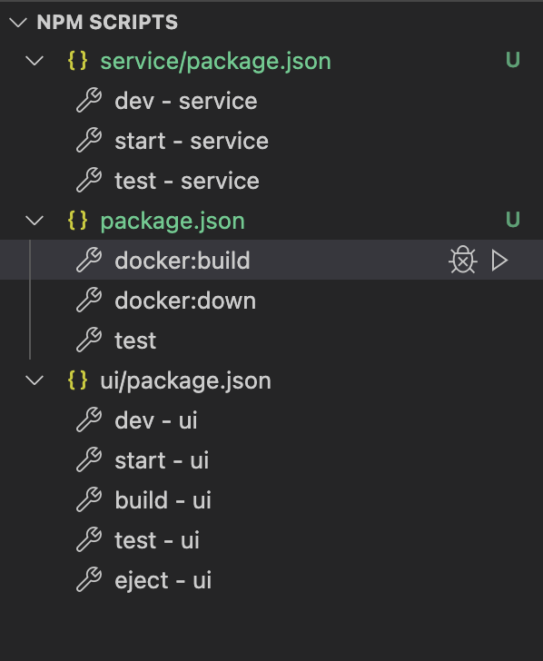

# Prac - App Starter

* PostGRESql DB
* Create-React-App UI
* Node & Express App server
* Docker

# Credits

[Docker compose, React, Node and PostGres by American Dreamer](https://hardcoded.medium.com/docker-compose-with-react-node-and-postgresql-a-multi-container-application-with-docker-a11197802e33).

# Editor

Works best with Visual Studio Code. All NPM scripts [can be run from nav panel with a single click](https://www.youtube.com/watch?v=Sf1EP5n8RoQ). If it doesn't display, [check the settings](http://www.matthiassommer.it/programming/testing/run-npm-scripts-in-visual-studio-code-with-a-click-of-a-button/). 

# Begin notes
Start up docker images:
- docker-compose up -d
- docker-compose up -d ui

login to pgadmin and connect to db
- nav to http://localhost:16543/browser/
-       PGADMIN_DEFAULT_EMAIL: "postgres@test.com"
      PGADMIN_DEFAULT_PASSWORD: "postgres"
- add new connection
- `docker ps`
- `docker inspect {id of postgres cont} | grep IPAddress
`
- paste in ip
- user: root, pw: pass

Deactivate:
- docker-compose down

Ports, components run on the following localhost ports
- stashbot_server: 8080:3000
- stashbot_ui: 3000:3000
- stashbot_db_ui: 16543:80
- stashbot-db: 5432:5432

Rebuild docker images and run thru dockerfile commands:
docker-compose up -d --build
docker-compose build ui
docker-compose build service

fix build issue:
docker container prune

### test server
http://localhost:8080/stashbot/holditem